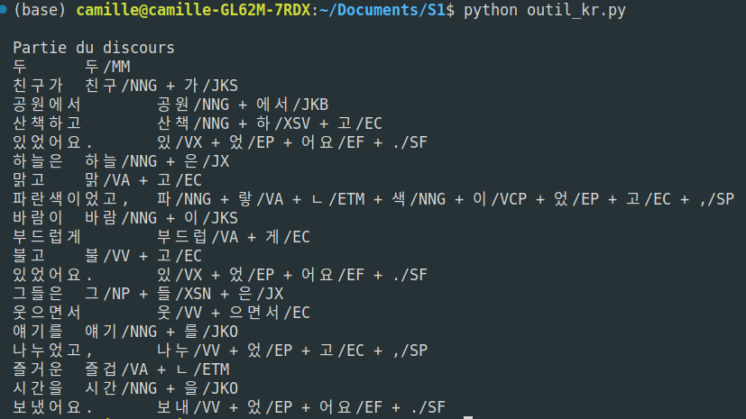

## 27.09.2023

#### Groupe : Camille, Clément, Fanny, Tifanny

**Nom** : khaiii

**Crée le** : 2018

**Dernière release** : 17 juin 2019

**Par** : Kakao Corp.

**Licence** : Licence open source : Apache License 2.0

**Langue** : Coréen

**Programmé en** : C++ 14 / package en Python pour que les utilisateurs interagissent avec Khaiii en utilisant Python. 

**Lien du git** : https://github.com/kakao/khaiii

**Description** : Khaiii est le troisième analyseur morphologique développé par Kakao, succédant à dha2 (sur la base de dictionnaires et de règles). Il utilise l'apprentissage automatique avec un réseau neuronal convolutif (CNN) pour l'analyse morphologique du coréen.
Le corpus d'apprentissage provient du “21st Century Sejong Project” (constitué de textes écrits en coréen, provenant de diverses sources et domaines. Le but de ce corpus est de servir de base pour la recherche linguistique, l'analyse linguistique, et le développement de ressources linguistiques visant à améliorer la compréhension et l'utilisation de la langue coréenne.) distribué par l'Institut national de la langue coréenne, avec des erreurs corrigées et du contenu ajouté par Kakao.
En excluant les phrases comportant des erreurs lors du processus de prétraitement, khaiii s’est entraîné en utilisant un corpus d'environ 850 000 phrases et 10 millions de mots.

**Installation** : 
- Installation de bibliothèque nécessaire
```bash
pip install cmake
```

- Clone du git du projet
```bash
git clone https://github.com/kakao/khaiii.git
```

- Création d’un dossier build afin d’y exécuter cmake
```bash
cd khaiii
mkdir build
cd build
cmake -E env CXXFLAGS="-w" cmake ..
```

- Construction de khaiii et de ses ressources grâce à cmake

```bash
make all
# pour le modèle large
make large_resource 
```

**Problèmes liés à l'installation** : Quelques difficultés

Au lieu de ```cmake -E env CXXFLAGS="-w" cmake ..``` , j’étais d’abord tombée sur un guide d’installation m’indiquant d’écrire ```cmake ..```.
Sauf qu’en écrivant seulement ça, il y a eu des erreurs : 
 
Il s’agit de faire en sorte que les warnings ne soient pas considérés comme des erreurs à la compilation.

Au niveau de ```make all```, il y a eu une montagne d'erreur dont voici la fin :


Le problème étant l'installation de la bibliothèque "cxxopts". Elle n’était pas installée dans le projet, je l’ai donc installée. Le fichier “cxxopts.hpp” était pourtant appelé de base dans plusieurs fichiers du dossier source. En corrigeant le chemin d’accès au fichier dans tous les fichiers source qui appelait cette bibliothèque tout s’est déroulé sans accrocs par la suite.

**Tâche** :  POS tagging

**Fonctionnement**

Rester dans le dossier build et taper : ```./bin/khaiii --rsc-dir=./share/khaiii```, il suffira ensuite de taper directement dans le terminal la phrase à analyser.

Si on veut l’utiliser avec python, il va falloir écrire : 
```bash
make package_python 
cd package_python
pip install .
```
Pour enfin l’utiliser tel que : 


**Résultats**

En ligne de commande : 

En éxecutant le script Python : 


---

**Nom** : Underthesea

**Crée le** : Mars 2017

**Dernière release** : 28 juillet 2023

**Par** : Underthesea

**Licence** : GNU General Public License v3.0 license.

**Langue** : Vietnamien

**Programmé en** : Python

**Lien du git** : https://github.com/undertheseanlp/underthesea/tree/main

**Lien du site** : https://undertheseanlp.com/#!/

**Description** : BAO qui contient de nombreux modules en python pour traiter le Vietnamien.

**Installation** : 
```bash
pip install underthesea
```
et/ou 
```bash
pip install underthesea[deep] #(pour le parsing par ex)
```

**Problèmes liés à l'installation** : aucune

**Tâches** : Cette BAO permet de faire beaucoup de choses telles que : 
Séparer un texte en phrases individuelles (Sentence segmentation)
Standardiser (?) un texte
Word segmentation
POS Tagging
Chunking
Analyser les structures grammaticales entre les mots (Parsing)
Identifier les entités
Classifier des textes
Déterminer le ton/le sentiment d’un texte

[Script](UTS_test.py)


---

**Nom** : pyvi

**Crée le** : mars 2017

**Dernière release** : 17 mai 2020

**Par** : Viet-Trung Tran

**Licence** : OSI Approved :: MIT License

**Langue** : Vietnamien

**Programmé en** : Python

**Lien du git** : https://github.com/trungtv/pyvi

**Lien du site** : https://pypi.org/project/pyvi/

**Description** : Outil python pour le vietnamien // scores : Vietnamese tokenizer f1_score = 0.985 | Vietnamese pos tagging f1_score = 0.925

**Installation** : 
```bash
pip install pyvi
```

**Problèmes liés à l'installation** :

**Tâches** : Tokenisation, POS tagging, Accents removal et Accents adding 

**Utilisation** : [Script](script_pyvi/script_pyvi.py)

**Résultats** : 
