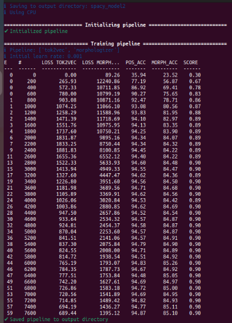

# TP Valentina Osetrov

Projet de groupe avec Sandra et Kenza.
Nous allons travailler sur le POS tagging en polonais.
Les outils : spacy et treetagger

Corpus choisi pour entraîner spacy : universal dependencies polish lfg (https://github.com/UniversalDependencies/UD_Polish-LFG)

## Convertir les fichiers pour le format spacy

`python3 -m spacy convert corpus_polonais/corpus-lfg/pl_lfg-ud-train.conllu corpus_polonais/corpus-ent`

`python3 -m spacy convert corpus_polonais/corpus-lfg/pl_lfg-ud-dev.conllu corpus_polonais/corpus-ent`

`python3 -m spacy convert corpus_polonais/corpus-lfg/pl_lfg-ud-test.conllu corpus_polonais/corpus-ent`

## Créer fichier config avec morphologizer

`python3 -m spacy init fill-config config-pl/base_config.cfg config-pl/config.cfg`

## Télécharger les modèles polonais spacy 

`python -m spacy download pl_core_news_sm`
`python -m spacy download pl_core_news_md`
`python -m spacy download pl_core_news_lg`

## Entraîner le modèle spacy

`python3 -m spacy train ./config-pl/config.cfg --output ./spacy_model2/ --paths.train ./corpus_pl-ud/corpus-ent/pl_lfg-ud-train.spacy --paths.dev ./corpus_pl-ud/corpus-ent/pl_lfg-ud-dev.spacy`

## Evaluation des modèles : 

`model-best
(0.9487492373398414, 0.8625050999592003)
news
(0.952037947997189, 0.8691056910569106)
fiction
(0.9453857542358941, 0.8580952380952381)
(media)
(0.9384615384615385, 0.8571428571428571)
social
(0.9629629629629629, 0.8823529411764706)
(conversational)
(0.9293361884368309, 0.7727272727272727)
nonfiction
(0.9362445414847161, 0.8558951965065502)
(prepared)
(0.9654255319148937, 0.8)
legal
(1.0, 1.0)
blog
(0.9652173913043478, 0.9629629629629629)
academic
(0.8181818181818182, 0.3333333333333333)

pl_core_news_sm
(0.949359365466748, 0.9143206854345165)
news
(0.9567814476458187, 0.9219512195121952)
fiction
(0.9416022372100674, 0.9057142857142857)
(media)
(0.9384615384615385, 1.0)
social
(0.9528619528619529, 0.9607843137254902)
(conversational)
(0.9357601713062098, 0.8409090909090909)
nonfiction
(0.9362445414847161, 0.9170305676855895)
(prepared)
(0.976063829787234, 0.9142857142857143)
legal
(1.0, 1.0)
blog
(0.9565217391304348, 0.8888888888888888)
academic
(0.9090909090909091, 1.0)

pl_core_news_md
(0.9553843807199512, 0.9367605059159527)
news
(0.9634574841883345, 0.9390243902439024)
fiction
(0.9485112683007073, 0.9352380952380952)
(media)
(0.9384615384615385, 1.0)
social
(0.9663299663299664, 0.9803921568627451)
(conversational)
(0.9357601713062098, 0.8636363636363636)
nonfiction
(0.9423580786026201, 0.9170305676855895)
(prepared)
(0.976063829787234, 1.0)
legal
(1.0, 1.0)
blog
(0.9304347826086956, 0.8518518518518519)
academic
(0.7272727272727273, 0.6666666666666666)

pl_core_news_lg
(0.9576723611958511, 0.941656466748266)
news
(0.9660927617709065, 0.9479674796747968)
fiction
(0.9506497779240006, 0.9361904761904762)
(media)
(0.9384615384615385, 1.0)
social
(0.9562289562289562, 0.9803921568627451)
(conversational)
(0.9400428265524625, 0.8863636363636364)
nonfiction
(0.9475982532751092, 0.9301310043668122)
(prepared)
(0.9787234042553191, 0.9714285714285714)
legal
(1.0, 1.0)
blog
(0.9478260869565217, 0.8518518518518519)
academic
(0.7272727272727273, 0.6666666666666666)

model best

              precision    recall  f1-score   support

         ADJ       0.90      0.93      0.91       800
         ADP       0.99      0.94      0.97      1160
         ADV       0.96      0.91      0.93       617
         AUX       0.57      0.92      0.70       264
       CCONJ       0.99      0.96      0.97       364
         DET       0.90      0.97      0.94       301
        INTJ       0.33      0.67      0.44         3
        NOUN       0.94      0.92      0.93      2526
         NUM       0.93      0.94      0.94        89
        PART       0.96      0.99      0.97       583
        PRON       0.99      0.97      0.98      1001
       PROPN       0.84      0.89      0.86       448
       PUNCT       1.00      1.00      1.00      2555
       SCONJ       0.99      0.95      0.97       147
        VERB       0.97      0.94      0.95      2254

    accuracy                           0.95     13112
   macro avg       0.88      0.93      0.90     13112
weighted avg       0.95      0.95      0.95     13112

pl_core_news_sm
              precision    recall  f1-score   support

         ADJ       0.96      0.95      0.95       842
         ADP       0.99      0.99      0.99      1101
         ADV       0.93      0.93      0.93       586
         AUX       0.53      0.79      0.64       289
       CCONJ       0.95      0.95      0.95       353
         DET       0.95      0.97      0.96       317
        INTJ       0.33      0.40      0.36         5
        NOUN       0.96      0.94      0.95      2512
         NUM       0.94      0.99      0.97        86
        PART       0.93      0.93      0.93       600
        PRON       0.99      0.98      0.98       995
       PROPN       0.87      0.81      0.84       503
       PUNCT       1.00      1.00      1.00      2556
       SCONJ       0.99      0.87      0.92       160
        VERB       0.94      0.96      0.95      2142
           X       0.00      0.00      0.00        65

    accuracy                           0.95     13112
   macro avg       0.83      0.84      0.83     13112
weighted avg       0.95      0.95      0.95     13112

pl_core_news_md
              precision    recall  f1-score   support

         ADJ       0.96      0.94      0.95       850
         ADP       0.99      0.99      0.99      1098
         ADV       0.92      0.95      0.93       574
         AUX       0.55      0.79      0.64       298
       CCONJ       0.95      0.96      0.96       352
         DET       0.95      0.96      0.96       321
        INTJ       0.50      0.75      0.60         4
        NOUN       0.97      0.96      0.97      2466
         NUM       0.99      0.98      0.98        91
        PART       0.95      0.93      0.94       605
        PRON       0.99      0.96      0.97      1015
       PROPN       0.90      0.87      0.89       488
       PUNCT       1.00      1.00      1.00      2555
       SCONJ       0.99      0.87      0.92       160
        VERB       0.96      0.98      0.97      2134
           X       0.00      0.00      0.00       101

    accuracy                           0.96     13112
   macro avg       0.85      0.87      0.85     13112
weighted avg       0.95      0.96      0.95     13112

pl_core_news_lg
              precision    recall  f1-score   support

         ADJ       0.97      0.95      0.96       849
         ADP       0.99      0.99      0.99      1098
         ADV       0.93      0.94      0.94       581
         AUX       0.54      0.78      0.64       298
       CCONJ       0.97      0.97      0.97       353
         DET       0.96      0.97      0.96       322
        INTJ       0.33      0.40      0.36         5
        NOUN       0.97      0.96      0.97      2480
         NUM       0.98      0.98      0.98        90
        PART       0.94      0.95      0.94       595
        PRON       0.99      0.98      0.98       994
       PROPN       0.91      0.83      0.87       517
       PUNCT       1.00      1.00      1.00      2555
       SCONJ       0.99      0.87      0.93       159
        VERB       0.96      0.98      0.97      2140
           X       0.00      0.00      0.00        76

    accuracy                           0.96     13112
   macro avg       0.84      0.85      0.84     13112
weighted avg       0.96      0.96      0.96     13112
`

## TreeTagger

Installer treetagger et les paramètres pour le polonais

## Entrainer un modèle treetagger : 

`bin/train-tree-tagger train-treetagger/lexicon.txt train-treetagger/tags.txt train-treetagger/annotated.txt train-treetagger/model_name -st PUNCT`

## Tagger avec notre modèle : 

`bin/tree-tagger train-treetagger/model_name text4TT.txt text4TTv.txt -token`

## Évaluation

TREE-TAGGER RESULTS ORIGINAL
news
(0.8034082923401265, 0.8056910569105691)
fiction
(0.8001316005922027, 0.8257142857142857)
(media)
(0.9076923076923077, 1.0)
social
(0.7912457912457912, 0.8431372549019608)
(conversational)
(0.8115631691648822, 0.8181818181818182)
nonfiction
(0.7912663755458516, 0.8733624454148472)
(prepared)
(0.8537234042553191, 0.7714285714285715)
legal
(0.7, 0.75)
blog
(0.7565217391304347, 0.7777777777777778)
academic
(0.6363636363636364, 1.0)

              precision    recall  f1-score   support

         ADJ       0.71      0.85      0.77       830
         ADP       0.99      0.99      0.99      1097
         ADV       0.98      0.95      0.97       589
         AUX       0.00      0.00      0.00       429
       CCONJ       0.00      0.00      0.00       354
        CONJ       0.00      0.00      0.00         0
         DET       0.00      0.00      0.00       324
        INTJ       0.71      0.83      0.77         6
        NOUN       0.78      0.97      0.86      2457
         NUM       0.59      1.00      0.74        90
        PART       0.58      0.95      0.72       597
        PRON       1.00      0.40      0.57       986
       PROPN       0.00      0.00      0.00       470
       PUNCT       1.00      1.00      1.00      2555
       SCONJ       0.00      0.00      0.00       141
        VERB       0.79      0.99      0.88      2187
           X       0.00      0.00      0.00         0

    accuracy                           0.80     13112
   macro avg       0.48      0.53      0.49     13112
weighted avg       0.75      0.80      0.76     13112

TREE-TAGGER RESULTS ENTRAINE
news
(0.9219957835558679, 0.8146341463414634)
fiction
(0.922520151340681, 0.7914285714285715)
(media)
(0.9384615384615385, 1.0)
social
(0.9292929292929293, 0.7450980392156863)
(conversational)
(0.9229122055674518, 0.8409090909090909)
nonfiction
(0.9126637554585153, 0.7947598253275109)
(prepared)
(0.9627659574468085, 0.7714285714285715)
legal
(0.8, 0.5)
blog
(0.9043478260869565, 0.7777777777777778)
academic
(0.6363636363636364, 0.3333333333333333)

              precision    recall  f1-score   support

         ADJ       0.84      0.87      0.85       830
         ADP       0.99      0.99      0.99      1097
         ADV       0.72      0.92      0.81       589
         AUX       0.77      0.93      0.84       429
       CCONJ       0.99      0.45      0.62       354
         DET       0.84      0.98      0.91       324
        INTJ       1.00      0.33      0.50         6
        NOUN       0.89      0.94      0.92      2457
         NUM       0.91      0.91      0.91        90
        PART       0.97      0.96      0.97       597
        PRON       0.99      0.89      0.94       986
       PROPN       0.92      0.71      0.80       470
       PUNCT       1.00      1.00      1.00      2555
       SCONJ       0.96      0.94      0.95       141
        VERB       0.94      0.92      0.93      2187

    accuracy                           0.92     13112
   macro avg       0.92      0.85      0.86     13112
weighted avg       0.93      0.92      0.92     13112
