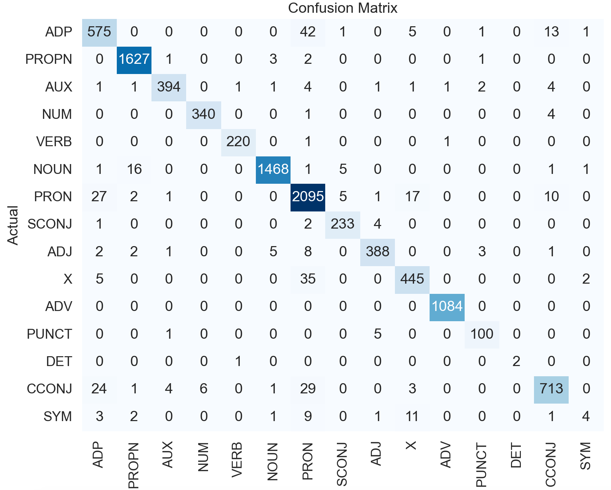

# TP1 - eval - Spacy POS tagging (suite)

## Étape 1

## Étape 2

Reprise du script fait en classe eval.py.

## Étape 3

Qualifier les résultats.

- [x] exatitude.
- [ ] vitesse.
- [x] matrice de confusion.
- [ ] comparer les modéles spacy et les différents corpus.

### Résultats

- **Exatitude** : `python3 eval.py`

```
(0.9645559538032656, 0.9645559538032656)
```

- **Matrice de confusion** :

##### Matrice 1 :

```
Confusion Matrix:
Overall Accuracy: 96.46%
OOV Accuracy: 96.46%
Tag: PRON
  True Positives: 388
  False Positives: 22
  False Negatives: 12
  Precision: 94.63%
  Recall: 97.00%
  F1 Score: 95.80%

Tag: VERB
  True Positives: 713
  False Positives: 68
  False Negatives: 34
  Precision: 91.29%
  Recall: 95.45%
  F1 Score: 93.32%

Tag: SCONJ
  True Positives: 100
  False Positives: 6
  False Negatives: 7
  Precision: 94.34%
  Recall: 93.46%
  F1 Score: 93.90%

Tag: DET
  True Positives: 1468
  False Positives: 25
  False Negatives: 11
  Precision: 98.33%
  Recall: 99.26%
  F1 Score: 98.79%

Tag: NOUN
  True Positives: 2095
  False Positives: 63
  False Negatives: 134
  Precision: 97.08%
  Recall: 93.99%
  F1 Score: 95.51%

Tag: ADJ
  True Positives: 575
  False Positives: 63
  False Negatives: 64
  Precision: 90.13%
  Recall: 89.98%
  F1 Score: 90.05%

Tag: PUNCT
  True Positives: 1084
  False Positives: 0
  False Negatives: 2
  Precision: 100.00%
  Recall: 99.82%
  F1 Score: 99.91%

Tag: ADV
  True Positives: 394
  False Positives: 17
  False Negatives: 8
  Precision: 95.86%
  Recall: 98.01%
  F1 Score: 96.92%

Tag: NUM
  True Positives: 233
  False Positives: 7
  False Negatives: 11
  Precision: 97.08%
  Recall: 95.49%
  F1 Score: 96.28%

Tag: ADP
  True Positives: 1627
  False Positives: 7
  False Negatives: 24
  Precision: 99.57%
  Recall: 98.55%
  F1 Score: 99.06%

Tag: PROPN
  True Positives: 445
  False Positives: 42
  False Negatives: 37
  Precision: 91.38%
  Recall: 92.32%
  F1 Score: 91.85%

Tag: CCONJ
  True Positives: 220
  False Positives: 2
  False Negatives: 2
  Precision: 99.10%
  Recall: 99.10%
  F1 Score: 99.10%

Tag: AUX
  True Positives: 340
  False Positives: 5
  False Negatives: 6
  Precision: 98.55%
  Recall: 98.27%
  F1 Score: 98.41%

Tag: X
  True Positives: 4
  False Positives: 28
  False Negatives: 4
  Precision: 12.50%
  Recall: 50.00%
  F1 Score: 20.00%

Tag: SYM
  True Positives: 2
  False Positives: 1
  False Negatives: 0
  Precision: 66.67%
  Recall: 100.00%
  F1 Score: 80.00%
```

##### Matrice 2 (sortie terminal):

```
Confusion Matrix:
[[ 575    0    0    0    0    0   42    1    0    5    0    1    0   13
     1]
 [   0 1627    1    0    0    3    2    0    0    0    0    1    0    0
     0]
 [   1    1  394    0    1    1    4    0    1    1    1    2    0    4
     0]
 [   0    0    0  340    0    0    1    0    0    0    0    0    0    4
     0]
 [   0    0    0    0  220    0    1    0    0    0    1    0    0    0
     0]
 [   1   16    0    0    0 1468    1    5    0    0    0    0    0    1
     1]
 [  27    2    1    0    0    0 2095    5    1   17    0    0    0   10
     0]
 [   1    0    0    0    0    0    2  233    4    0    0    0    0    0
     0]
 [   2    2    1    0    0    5    8    0  388    0    0    3    0    1
     0]
 [   5    0    0    0    0    0   35    0    0  445    0    0    0    0
     2]
 [   0    0    0    0    0    0    0    0    0    0 1084    0    0    0
     0]
 [   0    0    1    0    0    0    0    0    5    0    0  100    0    0
     0]
 [   0    0    0    0    1    0    0    0    0    0    0    0    2    0
     0]
 [  24    1    4    6    0    1   29    0    0    3    0    0    0  713
     0]
 [   3    2    0    0    0    1    9    0    1   11    0    0    0    1
     4]]

Classification Report:
              precision    recall  f1-score   support

         ADJ       0.90      0.90      0.90       638
         ADP       0.99      1.00      0.99      1634
         ADV       0.98      0.96      0.97       411
         AUX       0.98      0.99      0.98       345
       CCONJ       0.99      0.99      0.99       222
         DET       0.99      0.98      0.99      1493
        NOUN       0.94      0.97      0.96      2158
         NUM       0.95      0.97      0.96       240
        PRON       0.97      0.95      0.96       410
       PROPN       0.92      0.91      0.92       487
       PUNCT       1.00      1.00      1.00      1084
       SCONJ       0.93      0.94      0.94       106
         SYM       1.00      0.67      0.80         3
        VERB       0.95      0.91      0.93       781
           X       0.50      0.12      0.20        32

    accuracy                           0.96     10044
   macro avg       0.93      0.88      0.90     10044
weighted avg       0.96      0.96      0.96     10044


```

#### Représentation matricielle


