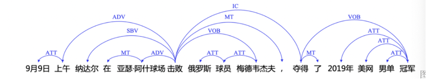
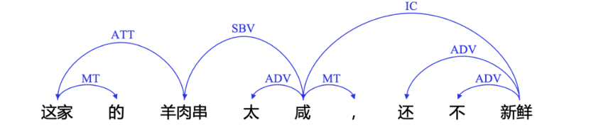

# first project

## groupe

- Alice Wallard
- Laura Darenne
- Li Kedi
- Liza Fretel

On peut trouver un panorama des outils pour le chinois mandarin standard de la RPC sur le git de Beijing University,  cette liste n'est pas exhaustive bien entendu et cela nous montre que le chinois mandarin est bien dotée :

- [THULAC 中文词法分析工具包](http://thulac.thunlp.org/) by 清华 (C++/Java/Python)
- [NLPIR](https://github.com/NLPIR-team/NLPIR) by 中科院 (Java)
- [LTP 语言技术平台](https://github.com/HIT-SCIR/ltp) by 哈工大 (C++) [pylyp](https://github.com/HIT-SCIR/pyltp) LTP的python封装
- [FudanNLP](https://github.com/FudanNLP/fnlp) by 复旦 (Java)
- [BaiduLac](https://github.com/baidu/lac) by 百度 Baidu's open-source
   lexical analysis tool for Chinese, including word segmentation,
   part-of-speech tagging & named entity recognition.
- [HanLP](https://github.com/hankcs/HanLP) (Java)
- [FastNLP](https://github.com/fastnlp/fastNLP) (Python) 一款轻量级的 NLP 处理套件。
- [SnowNLP](https://github.com/isnowfy/snownlp) (Python) Python
   library for processing Chinese text
- [YaYaNLP](https://github.com/Tony-Wang/YaYaNLP) (Python) 纯python编写的中文自然语言处理包，取名于“牙牙学语”
- [小明NLP](https://github.com/SeanLee97/xmnlp) (Python) 轻量级中文自然语言处理工具
- [DeepNLP](https://github.com/rockingdingo/deepnlp) (Python) Deep
   Learning NLP Pipeline implemented on Tensorflow with pretrained Chinese
   models.
- [chinese_nlp](https://github.com/taozhijiang/chinese_nlp) (C++
   & Python) Chinese Natural Language Processing tools and examples
- [lightNLP](https://github.com/smilelight/lightNLP) (Python) 基于Pytorch和torchtext的自然语言处理深度学习框架
- [Chinese-Annotator](https://github.com/crownpku/Chinese-Annotator) (Python) Annotator for Chinese Text Corpus 中文文本标注工具
- [Poplar](https://github.com/synyi/poplar) (Typescript) A web-based
   annotation tool for natural language processing (NLP)
- [Jiagu](https://github.com/ownthink/Jiagu) (Python) Jiagu以BiLSTM等模型为基础，使用大规模语料训练而成。将提供中文分词、词性标注、命名实体识别、情感分析、知识图谱关系抽取、关键词抽取、文本摘要、新词发现等常用自然语言处理功能。
- [SmoothNLP](https://github.com/smoothnlp/SmoothNLP) (Python &
   Java) 专注于可解释的NLP技术
- [FoolNLTK](https://github.com/rockyzhengwu/FoolNLTK) (Python &
   Java) A Chinese Nature Language Toolkit

Nous en avons choisi de travailler sur trois outils sélectionnés sur Github après une recherche :

1. n-ltp

2. deep-nlp

3. ddparser

Tous les outils ont été développé particulièrement pour le chinois mandarin, mais certains ont des modèles anglais. Nous avons testé les modèles chinois.

Une autre particularité, les trois outils présentés sont capables de produire une analyse syntaxique, ce sur quoi nous allons nous pencher.

Ex : 9月9日上午，纳达尔在亚瑟阿什球场击败俄罗斯球员梅德韦杰夫，赢得个人第 24 座大满贯奖杯。
Le matin du 9 septembre, Nadal a triomphé le joueur russe Dmitry Medvedev au stade Arthur Ashe et remporté son 24e Grand Chelem.


Ex：这家的鱼太咸了，还不新鲜。
Le poisson de ce restaurant est trop salé et pas assez frais.


## n-ltp = outil open-source présent sur git-hub

### urls

- https://aclanthology.org/2021.emnlp-demo.6/
- https://github.com/HIT-SCIR/ltp/blob/main/python/interface/README.md

### téléchargement

```
# installer les dépendances pytorch et transformers
pip install -i https://pypi.tuna.tsinghua.edu.cn/simple torch transformers

# installer ltp
pip install -i https://pypi.tuna.tsinghua.edu.cn/simple ltp ltp-core ltp-extension
```

### D’où vient cet outil?

- présent sur github (issues...)
- open-source
- licence du Centre de recherche en informatique sociale et en recherche d'informations de l'Institut de technologie de Harbin 
- article acl pour présenter le projet : utilisation gratuite à fin non-commerciale (sinon contacter le centre de recherche)
- créé par deux étudiants/chercheurs chinois pour faire les tâches suivantes :
  - chinese word segmentation, 
  - part-of-speech tagging, 
  - named entity recognition
  - syntactic parsing (dependency parsing)
  - semantic dependency parsing
  - semantic role labeling

```
# cws : segmentation de mots
# pos : partie du discours 
# ner : reconnaissance d'entité nommée 
# srl : annotation de rôle sémantique
# dep : analyse syntaxique en dépendance
# sdp : arbre d'analyse sémantique en dépendance
# sdpg : graphique d'analyse sémantique en dépendance
```

### Comment ça marche et quel type de sorties propose-t-il?

#### avec le modèle par défaut, LTP/small

```
import torch
from ltp import LTP

# telecharge par defaut le modèle depuis huggingface
# charge par default le petit modèle
# sinon ltp = LTP("/path/to/your/model")
ltp = LTP("LTP/small")  

# si gpu...
if torch.cuda.is_available():
    # ltp.cuda()
    ltp.to("cuda")

output = ltp.pipeline(["他叫汤姆去拿外衣。"], tasks=["cws", "pos", "ner", "srl", "dep", "sdp", "sdpg"])
print(output.cws) # avec indices ou version dict : print(output[0]) / print(output['cws'])
print(output.pos)
print(output.ner)
print(output.srl)
print(output.dep)
print(output.sdp)
print(output.sdpg)
```

```
[['他', '叫', '汤姆', '去', '拿', '外衣', '。']]
[['r', 'v', 'nh', 'v', 'v', 'n', 'wp']]
[[('Nh', '汤姆')]]
[[{'predicate': '叫', 'arguments': [('A0', '他'), ('A1', '汤姆'), ('A2', '去拿外衣')]}, {'predicate': '拿', 'arguments': [('A0', '汤姆'), ('A1', '外衣')]}]]
[{'head': [2, 0, 2, 5, 2, 5, 2], 'label': ['SBV', 'HED', 'DBL', 'ADV', 'VOB', 'VOB', 'WP']}]
[{'head': [2, 0, 2, 2, 4, 5, 2], 'label': ['AGT', 'Root', 'DATV', 'eSUCC', 'eSUCC', 'PAT', 'mPUNC']}]
[[(1, 2, 'AGT'), (2, 0, 'Root'), (3, 2, 'DATV'), (3, 4, 'AGT'), (3, 5, 'AGT'), (4, 2, 'eSUCC'), (5, 2, 'eSUCC'), (5, 4, 'eSUCC'), (6, 5, 'PAT'), (7, 2, 'mPUNC')]]
```

Pour accéder à une des réponses, il est possible d'utiliser l'indentation ou `output.qqchose`. Certains résultats sont en liste, liste de tuples ou dictionnaires. Voici les résultats bruts :

```
LTPOutput(
    cws=[['他', '叫', '汤姆', '去', '拿', '外衣', '。']], 
    pos=[['r', 'v', 'nh', 'v', 'v', 'n', 'wp']], 
    ner=[[('Nh', '汤姆')]], 
    srl=[[{'predicate': '叫', 'arguments': [('A0', '他'), ('A1', '汤姆'), ('A2', '去拿外衣')]}, {'predicate': '拿', 'arguments': [('A0', '汤姆'), ('A1', '外衣')]}]], 
    dep=[{'head': [2, 0, 2, 5, 2, 5, 2], 'label': ['SBV', 'HED', 'DBL', 'ADV', 'VOB', 'VOB', 'WP']}], 
    sdp=[{'head': [2, 0, 2, 2, 4, 5, 2], 'label': ['AGT', 'Root', 'DATV', 'eSUCC', 'eSUCC', 'PAT', 'mPUNC']}], 
    sdpg=[[(1, 2, 'AGT'), (2, 0, 'Root'), (3, 2, 'DATV'), (3, 4, 'AGT'), (3, 5, 'AGT'), (4, 2, 'eSUCC'), (5, 2, 'eSUCC'), (5, 4, 'eSUCC'), (6, 5, 'PAT'), (7, 2, 'mPUNC')]]
    )
```

#### Avec le modèle LTP/legacy

Il existe un autre modèle qui rend la segmentation des mots, la reconnaissance de parties du discours et d'entités nommées relativement + rapide, mais la précision est légèrement inférieure.

```
# algorithme perceptron qui ne fait pas plus que cws, pos, net
ltp = LTP("LTP/legacy")

cws, pos, ner = ltp.pipeline(["他叫汤姆去拿外衣。"], tasks=["cws", "pos", "ner"]).to_tuple()
print(cws, pos, ner)
```

```
[['他', '叫', '汤姆', '去', '拿', '外衣', '。']] [['r', 'v', 'nh', 'v', 'v', 'n', 'wp']] [[('Nh', '汤姆')]]
```

Voici les résultats bruts :

```
print(ltp.pipeline(["他叫汤姆去拿外衣。"], tasks=["cws", "pos", "ner"]).to_tuple())
```

```
(
    [['他', '叫', '汤姆', '去', '拿', '外衣', '。']], 
    [['r', 'v', 'nh', 'v', 'v', 'n', 'wp']], 
    [[('Nh', '汤姆')]]
)
```

## deep-nlp

### url

- https://github.com/rockingdingo/deepnlp

### téléchargement

- pour télécharger le module : `pip install deepnlp`

- pour télécharger les modèles, directement sur le script python :
  
  ```
  import deepnlp
  ```

# Download all the modules

deepnlp.download()

# Download specific module

deepnlp.download('segment')
deepnlp.download('pos')
deepnlp.download('ner')
deepnlp.download('parse')

# Download module and domain-specific model

deepnlp.download(module = 'pos', name = 'en')
deepnlp.download(module = 'ner', name = 'zh_entertainment')

```
### D’où vient cet outil?
- développé par un certain rockingdingo mais il ne donne aucune information sur lui ou son travail

### Quel type de sorties propose-t-il?
- Word Segmentation/Tokenization
- Part-of-speech (POS)
- Named-entity-recognition(NER)
- Dependency Parsing (Parse)
- textsum: automatic summarization Seq2Seq-Attention models
- textrank: extract the most important sentences
- textcnn: document classification
- Web API: Free Tensorflow empowered web API
- Planed: Automatic Summarization

### Si on arrive à le faire marcher, comment ça marche
- cet outil ne marche pas sur nos machines
- `deepnlp` n'est plus mis à jour depuis 6 ans (dernier commit en janvier 2018) et dernière issue fermée par le dev en 2018
- le module est encore téléchargeable mais il ne marche pas à cause du module `crfpp` :
    - issue ouverte depuis 2 ans sur le git de deepnlp : "No module named 'CRFPP'"
    - le module `crfpy` installable via pip n'est plus  telechargeable, le dossier git dont il est issu n'est plus disponible
  - le module `crf++` contenant lui aussi `crfpp` n'est plus mise à jour depuis 2013 et le miroir de téléchargement est cassé (pas de fichier Release)
  - le module `crfpp` qui est téléchargeable en clonant le dossier git `deepnlp` n'est plus installable, il se télécharge d'une manière que python ne prend plus en charge (`python setup.py install`)

#### pour la segmentation
```

from deepnlp import segmenter

tokenizer = segmenter.load_model(name = 'zh_entertainment')
text = "我刚刚在浙江卫视看了电视剧老九门，觉得陈伟霆很帅"
segList = tokenizer.seg(text)
text_seg = " ".join(segList)

#Results

# 我 刚刚 在 浙江卫视 看 了 电视剧 老九门 ， 觉得 陈伟霆 很 帅

```
#### pour les entités nommées :
```

import deepnlp
from deepnlp import ner_tagger

deepnlp.download('ner')  # download the NER pretrained models from github if installed from pip

# Example: Entertainment Model

tagger = ner_tagger.load_model(name='zh_entertainment')   # Base LSTM Based Model

#Load Entertainment Dict
tagger.load_dict("zh_entertainment")
text = "你 最近 在 看 胡歌 演的 猎场 吗 ?"
words = text.split(" ")
tagset_entertainment = ['actor', 'role_name', 'teleplay', 'teleplay_tag']
tagging = tagger.predict(words, tagset = tagset_entertainment)
for (w,t) in tagging:
    pair = w + "/" + t
    print (pair)

#Result
#你/nt
#最近/nt
#在/nt
#看/nt
#胡歌/actor
#演的/nt
#猎场/teleplay
#吗/nt
#?/nt

```
...

## DDParser

Baidu Dependency Parser (Analyseur de Dépendance Baidu) est un outil de Tal développé par la société chinoise Baidu. Son objectif principal est d'analyser la structure syntaxique des phrases dans le texte chinois, en identifiant les relations de dépendance entre les mots.

### url
- https://github.com/baidu/DDParser
- https://pypi.org/project/ddparser/

### téléchargement
- installer ddparser : `pip install ddparser`
- installer paddlepaddle avec ou sans cuda : 
    - `nvcc --version` + https://www.paddlepaddle.org.cn/
    - `pip install paddlepaddle==2.4.2`
- installer LAC : `pip install lac`

### D’où vient cet outil?
- Développé par l'entreprise Baidu
- Disponible sur Github
- open-source
- Les données utilisées par l'outil pour entraîner son modèle est Baidu Chinese Treebank 1.0. Il est composé d'un million de phrases mais l'outil en a utilisé 530k. Ce sont des données issues du web, écrites comme orales, des news, des forums etc.

### Quel type de sorties propose-t-il?
DDParser est utilisé pour faire de l'analyse syntaxique.
Il intègre un outil de tokenisation et de POS tagging, qui sont les étapes précédentes et nécessaires à l'analyse syntaxique.

#### Compatibilité CoNLL-X
La sortie est compatible avec le format CoNLL:
```

ID      FROM   LEMMA CPOSTAG POSTAG  FEATS   HEAD    DEPREL   PROB   PDEPREL
1       百度    百度    -       -       -       2       SBV     1.0     -
2       是      是      -       -       -       0       HED     1.0     -
3       一家    一家    -       -       -       5       ATT     1.0     -
4       高科技  高科技  -       -       -       5       ATT     1.0     -
5       公司    公司    -       -       -       2       VOB     1.0     -

```
#### Format de sortie
En sortie de la fonction parse ou parse_seg, on obtient une liste dont chaque élément est une phrase.
Dans cette liste, un dictionnaire avec 3 clés:
- 'word', avec pour valeur la liste des tokens.
- 'head', avec pour valeur une liste: pour chaque token, quelle est l'indice de la tête de la relation dans l'arbre syntaxique. 0 pour la racine.
- 'deprel', avec pour valeur une liste: pour chaque token, quelle est l'étiquête de la relation avec sa tête.
Exemple:
```

[{'word': ['百度', '是', '一家', '高科技', '公司'], 'head': [2, 0, 5, 5, 2], 'deprel': ['SBV', 'HED', 'ATT', 'ATT', 'VOB']}, {'word': ['他', '送', '了', '一本', '书'], 'head': [2, 0, 2, 5, 2], 'deprel': ['SBV', 'HED', 'MT', 'ATT', 'VOB']}]

```
### si on arrive à faire marcher, comment ça marche
- nous avons rencontré plusieurs problèmes :
    - avec paddle 2.5.1 :
        - `libssl.so.1.1: cannot open shared object file: No such file or directory`
            - solution :
            - `wget http://nz2.archive.ubuntu.com/ubuntu/pool/main/o/openssl/libssl1.1_1.1.1f-1ubuntu2.19_amd64.deb`
            - `sudo dpkg -i libssl1.1_1.1.1f-1ubuntu2.19_amd64.deb`
        - `AttributeError: module 'paddle.fluid.dygraph' has no attribute 'Layer'` 
            - nous n'avons pas trouvé de solution ; dans les issues sur le github, beaucoup de personnes ont des problèmes avec la classe `fluid`
    - avec paddle 2.4.2 :
        - marche à peu près mais des problèmes (Warnings) au niveau du téléchargement des modules car le python sur lequel ont travaille est trop haut

- sinon, marche comme cela :
```

from ddparser import DDParser
ddp = DDParser() # ajouter l'argument use_cuda=True pour utiliser un GPU.
         # ajouter l'argument buckets=True pour accélérer le traîtement d'un grand nombre de données de taille inégale.

#### Une seule phrase

ddp.parse("百度是一家高科技公司")

#### Plusieurs phrases

ddp.parse(["百度是一家高科技公司", "他送了一本书"])

#### On peut aussi avoir des phrases pré-tokenisées (par un autre outil par exemple)

ddp.parse_seg([['百度', '是', '一家', '高科技', '公司'], ['他', '送', '了', '一本', '书']])
